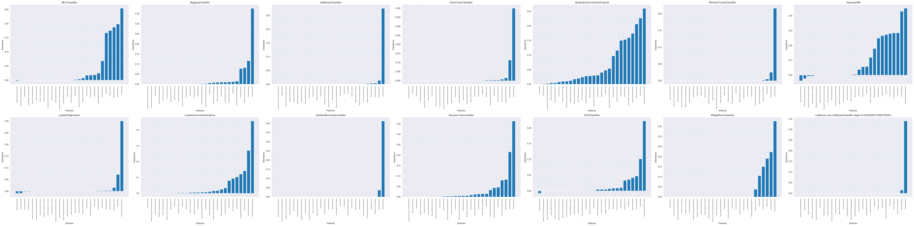
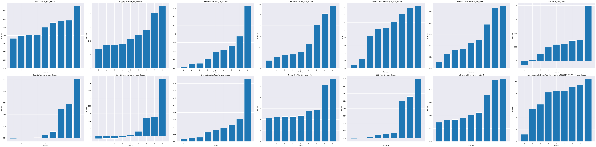
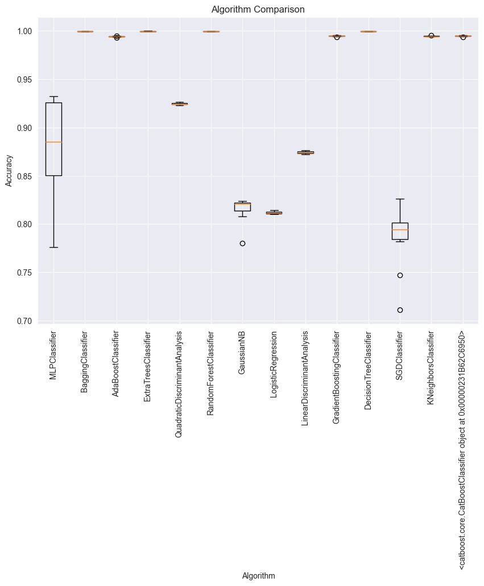
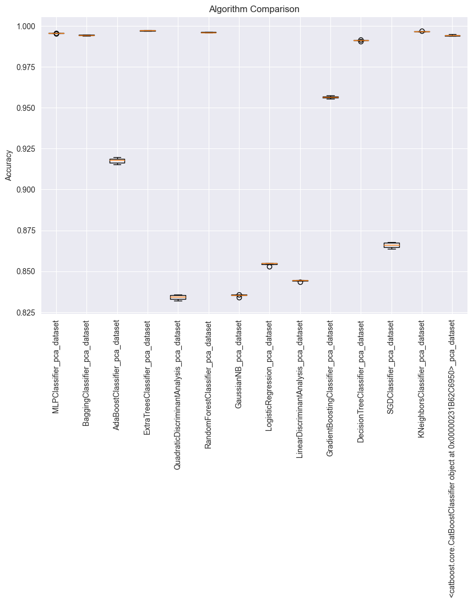
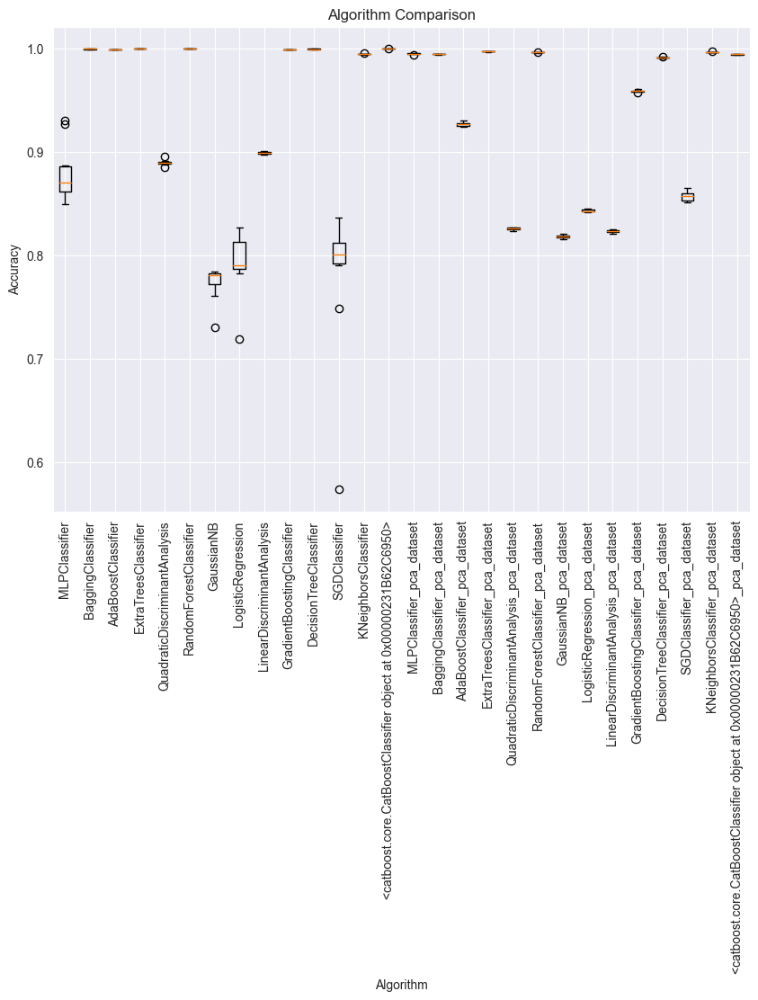
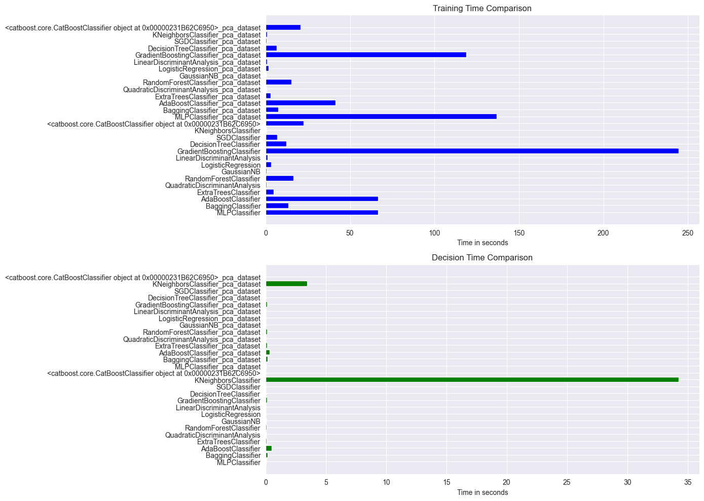
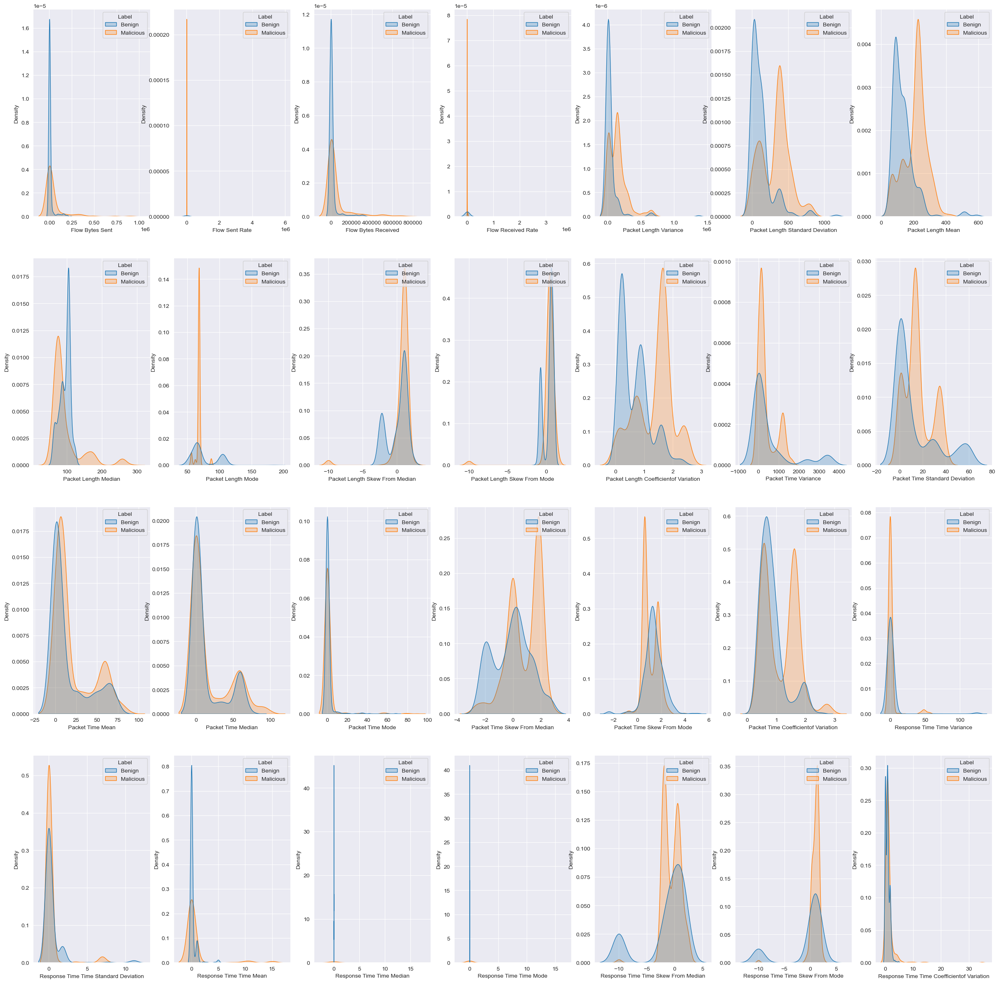

# AI Project

This project is part of teh AI course at FEUP (faculty of engineering of the University of Porto).
The model is a classification model that aims analize DNS queries and identify malicious activities and ensure cybersecurity.

This dataset, provided by Kaggle, consists of DNS queries collected in 2020 by the Canadian Internet Registration Authority (CIRA) in collaboration with BCCC and DOHBRW.
It represents a comprehensive collection of DNS over HTTP traffic. The data includes information on the time of queries, the type of requests, responses received, and possibly the servers that were queried.

Dataset:
https://www.kaggle.com/datasets/supplejade/bccc-cira-cic-dohbrw-2020-dns-over-http

# How to compile and run the code
1. Clone the repository
2. Run the notebooks as you would with any other jupyter notebook
   (compare models.ipynb, produce-pca.ipynb, data_visualization.ipynb, model-evaluation.ipynb)
   
    We are using IntelliJ DataSpell. We run it using the IDE's UI interface
      
    Dependencies:
         3. SKlearn
         4. Pandas
         5. Numpy
         6. Matplotlib
         7. Seaborn

# Data Pre Processing
In our pre-processement of data we did not find any invalid data, there was no missing values, and we applied PCA (Principal component analysis).
We made a correlation matrix and found that FlowReceivedRate and FlowSentRate rate are the one with the strongest correlation.

The correlation matrix is shown below:

# Most important features for each algorithm

The pictures below represent the most important features for each algorithm, with and without PCA.

# Comparing the Algorithms

In this section you can check som e comparison analysis between the algorithms used.

## Other important data

      
